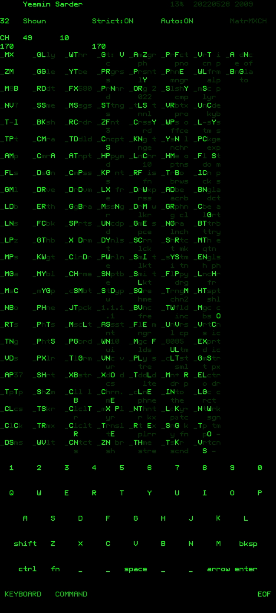

# Ap37-user-script
This is a custom user script for the launcher ap37 with added keyboard and other features
# Installation guide
1. Install [ap37 launcher](https://www.google.com/url?sa=t&source=web&rct=j&url=https://play.google.com/store/apps/details%3Fid%3Dcom.aurhe.ap37%26hl%3Den%26gl%3DUS%26referrer%3Dutm_source%253Dgoogle%2526utm_medium%253Dorganic%2526utm_term%253Dap37%26pcampaignid%3DAPPU_1_nHaMYvgZxdnPuw_eqZiwAQ&ved=2ahUKEwj419fmvPf3AhXF7HMBHd4UBhYQ5IQBegQIAxAF&usg=AOvVaw2u_bbbQ7tfpijcQBZyMVyn) from google play store.
2. Set ap37 as your default launcher.
3. In ap37 launcher press and hold the screen to bring up the code editor
4. Paste the [user_script.js](user_script.js) file's content in the editor and save.
    - Use Google Keyboard's text editor mode to easily paste into the editor.
    - Or, use keyboards like [Unexpected keyboard](https://www.google.com/url?sa=t&source=web&rct=j&url=https://github.com/Julow/Unexpected-Keyboard&ved=2ahUKEwjm5IW9v_f3AhXDUGwGHc_QADMQFnoECA0QAQ&usg=AOvVaw3J-KBuXXBJGetJ9lKA2dNT) or [hacker's keyboard](https://www.google.com/url?sa=t&source=web&rct=j&url=https://play.google.com/store/apps/details%3Fid%3Dorg.pocketworkstation.pckeyboard%26hl%3Den%26gl%3DUS%26referrer%3Dutm_source%253Dgoogle%2526utm_medium%253Dorganic%2526utm_term%253Dhacker%27s%2Bkeyboard%26pcampaignid%3DAPPU_1_wHmMYtrdNd-H5OUPluK_qAM&ved=2ahUKEwjavb3mv_f3AhXfA7kGHRbxDzUQ5YQBegQIAxAC&sqi=2&usg=AOvVaw2CX-vl4STmiZCBMhhXSmDh) to Copy/Paste.
5. Enjoy.

# Features
1. Open Source
2. Keyboard Support
    - Custom keyboard
3. Cooler app names using dropped vowels
   - eg
     - Facebook -> FCBK
     - Google Drive -> GGlE DRVE
   - last vowels are preserved for readability
4. Aliases
    - Autometically makes abbreviations for apps
    - Alias charecters are highlited in the app list and also printed on Capital letter.
    - eg
        - facebook -> FcBk
        - Google Drive -> Ggle Drve
        - FB and GD are the aliases respectively
5. Smart Search
    - if Strict: off
        - convert keyword to lowercase and Search case insensitively
        - use space as wildcards
             - as .* in regex and * in shells
        - eg
            - FcBk can be matched by 'fc', 'FC', ' ck', ' bk', 'f k' etc
            - FcBk will not match 'ck', 'bk', 'fk'
            
    - if Strict: on
        - conver keyword to upper case and Search case sensitively
            that means only Alias Charecters will match
        - .* wildcards are autometically added before search keyword and between charecters
        - eg
            - FcBk can be matched by 'F', 'B' and 'FB'
            - FcBk will not match 'C', 'c', 'Fc'
6. Auto launch
    - if only one app matches the search the app will instantly open even enter key is not pressed
    - That means in Strict mode typing 'FB' will instantly open facebook. Because aliases are unique.
7. Easy Customizations
8. Intercept loading and reload on keypress

# Changelog
    v6.0 - added Matrix effect
         [img](Screenshot_2022-05-26-09-19-01-28_7fc409285d4681be8665df281b86a4b0.jpg)
    v5.1 - new colour pallettes
    v5.0 - keyboard intercept
    v3.3 - optimized app loading
    v3.1 - strict and auto mode
    v3.0 - alias support
    v2.2 - keyboard optimization
    v2.0 - keyboard support
    v1.7 - basic app
